<!-- ═══════════════════ TYPING HEADER ═══════════════════ -->
<div align="center">
  
</div>

<br/>

<!-- ═══════════════════ IMPACT METRICS ROW ═══════════════════ -->
<div align="center">


</div>

<br/>

---

<!-- ═══════════════════ CODE BLOCK ABOUT ME ═══════════════════ -->


```python
class RamachandranBalasubrahmanian:
    """
    Data Management Leader · DAMA CDMP Practitioner
    Corporate Trainer · Vibe Coder · ex-FICO · Bengaluru 🇮🇳
    """

    name     = "Ramachandran Balasubrahmanian"
    location = "Bengaluru, India"
    degree   = "MCA · KGISL Institute of Information Management"

    leadership = {
        "teams_led"      : "11 direct reports · 7 Agile teams · 25+ engineers",
        "scope"          : "India · Canada · US",
        "clients"        : "50+ enterprise clients · 150+ platforms",
        "impact"         : "$10M+ ARR · $2M+ savings · 232M+ records",
    }

    expertise = [
        "Data Governance & DAMA DMBOK",
        "DataOps & Data Reliability",
        "MDM · Golden Records · Survivorship",
        "Metadata · Lineage · Data Cataloguing",
        "Data Quality · Incident RCA",
        "AI Governance · PII Privacy Controls",
        "ETL/ELT · Data Integration · Pipelines",
    ]

    trainer_domains = [
        "Data Integration & ETL/ELT",
        "Metadata Frameworks",
        "Data Quality Management",
        "Data Governance (DAMA DMBOK)",
        "AI Governance & Privacy Controls",
    ]

    vibe_code = ["Lovable.app", "Claude", "Gemini 1.5 Flash", "RAG Pipelines"]

    def motto(self):
        return (
            "Governance is not a static policy document."
            " Engineer it into the platform."
        )
```

<br clear="right"/>

---

<!-- ═══════════════════ QUICK CONNECT BAR ═══════════════════ -->
<div align="center">

[](https://www.linkedin.com/in/ramachandran-balasubrahmanian/)
[](https://ram-portfolio-amber.vercel.app)
[](https://pipeline-pulse-79.lovable.app/)
[](https://ram-portfolio-amber.vercel.app/assets/resume.pdf)
[](mailto:ramachandran.balasubrahmanian@gmail.com)
[](https://wa.me/919972657810)

</div>

---

<!-- ═══════════════════ OPERATING BELIEF ═══════════════════ -->
## 💡 What I Stand For

<div align="center">

> *"Governance should not be a static policy document. It should be **engineered into the platform**."*

</div>

```
 DATA PLATFORM TRUST CHAIN
 ──────────────────────────────────────────────────────────────────────
  Metadata  ──▶  Rules  ──▶  Controls  ──▶  Evidence  ──▶  Metrics
                                                               │
                                                               ▼
                                                       Business Trust ✅
 ──────────────────────────────────────────────────────────────────────
  Every layer governed · Every incident traceable · Every decision auditable
```

---

<!-- ═══════════════════ VIBE CODING ═══════════════════ -->
## ⚡ Vibe Coding — AI Governance Prototypes Built Live

> I build **working, production-grade AI governance tools** using Lovable.app, Claude, and Gemini — translating data management frameworks into live, clickable products without traditional dev overhead.

<div align="center">

### 🌟 Pipeline Pulse — AI Data Governance & PII Masking App

[](https://pipeline-pulse-79.lovable.app/)
[](https://lovable.app)
[](https://pipeline-pulse-79.lovable.app/)
[](https://pipeline-pulse-79.lovable.app/)

</div>

<div align="center">

| Capability | What It Does |
|:-----------|:-------------|
| 🔍 **Semantic PII Detection** | Gemini 1.5 Flash classifies sensitive fields across 100+ data paths automatically |
| 🔐 **Cryptographic Masking** | SHA-256 / SHA-512 masking with zero-trust ingestion and HITL safeguards |
| 🛡️ **ABAC Access Governance** | Attribute-based access control with immutable, audit-ready evidence trails |
| 📊 **Governance Dashboard** | Real-time incident tracking, lineage views, RCA panels, and quality metrics |
| 📋 **Multi-Compliance** | GDPR · HIPAA · SOX · SOC 2 · ISO 27001 · NIST · CCPA aligned |
| ⚡ **Impact** | 95% incident reduction pattern · 232M+ record protection model · $2M+ savings design |

</div>

---

<!-- ═══════════════════ CORPORATE TRAINER ═══════════════════ -->
## 🎓 Corporate Trainer — Data Management & Integration

> Delivered structured training programmes for **multiple corporate clients across India** — helping data teams build practical skills in governance, integration, quality, and AI-ready data operations.

<div align="center">

| 📚 Domain | Topics & Tools Covered | Audience |
|:----------|:------------------------|:---------|
| **Data Integration & ETL/ELT** | Pipeline design · Batch vs Streaming · Talend · Informatica · AWS Glue · dbt · Reconciliation patterns | Data Engineers · Platform Teams |
| **Metadata Frameworks** | Business & technical metadata · Data dictionaries · Lineage mapping · Microsoft Purview · Collibra · Apache Atlas | DG Teams · Architects |
| **Data Quality Management** | DAMA DQ dimensions · Rule design · Profiling · Validation engines · Incident RCA · ServiceNow integration | DQ Analysts · DataOps Teams |
| **Data Governance (DAMA DMBOK)** | DG operating models · Stewardship roles · Policy design · Ownership frameworks · Maturity assessments | CDO Offices · Business Leads |
| **Data Platform Operations** | DataOps reliability · SLA management · Observability · Golden Records · MDM workflows · Deduplication | Platform & Ops Teams |
| **AI Governance & Privacy** | PII classification · Masking patterns · GDPR / HIPAA controls · RAG governance · AI risk controls | Compliance · Risk Teams |

</div>

---

<!-- ═══════════════════ FULL TECH STACK ═══════════════════ -->
## 🛠️ Full Tech Stack — Data Management Leader & Practitioner

**🔤 Languages & Scripting**


**🗂️ Data Governance & Cataloguing**


**🔁 Data Integration, ETL & ELT**


**🧬 Master Data Management (MDM)**


**✅ Data Quality**


**☁️ Cloud Platforms & Data Warehouses**


**🗄️ Databases**


**📊 Analytics & BI**


**🤖 AI, GenAI & Vibe Coding**


**⚙️ DataOps, Observability & DevOps**


**📐 Data Strategy & Architecture Frameworks**


**🔒 Compliance, Privacy & Regulatory**


---

<!-- ═══════════════════ GITHUB STATS ═══════════════════ -->
## 📊 GitHub Stats

<div align="center">

[](https://github.com/ramachandranbalasubrahmanian-svg?tab=followers)
[](https://github.com/ramachandranbalasubrahmanian-svg)
[](https://github.com/ramachandranbalasubrahmanian-svg)

</div>

<div align="center">
  
</div>

<div align="center">
  
  &nbsp;
  
  &nbsp;
  
</div>

---

## 🔥 Streak Stats

<div align="center">
  
</div>

---

<!-- ═══════════════════ TROPHY WALL ═══════════════════ -->
## 🏆 Trophy Wall

<div align="center">



</div>

---

## 📈 Contribution Graph

<div align="center">
  
</div>

---

<!-- ═══════════════════ WORK EXPERIENCE ═══════════════════ -->
## 💼 Work Experience

<details>
<summary><strong>🏢 Fair Isaac Corporation (FICO)</strong> — Director / Senior Manager, AI Data Operations & Governance &nbsp;|&nbsp; Jun 2022 – Mar 2025 &nbsp;|&nbsp; Bengaluru, India</summary>

<br/>

>       

- 🏛️ **Led enterprise DG** across 11 direct reports, 7 Agile teams, and 25+ engineers (India, Canada, US) — ownership checkpoints, stewardship reviews, quality gates, and escalation paths aligned to DAMA DMBOK.
- 🤖 **Piloted GenAI & RAG workflows** using Microsoft Purview and Collibra to accelerate metadata search, lineage discovery, and audit evidence retrieval during compliance cycles.
- ⚡ **95% incident reduction in 3 months** via Detect-Resolve-Prevent DataOps model; downstream escalations reduced by 45%; ServiceNow-linked RCA evidence for every incident.
- 🔒 **Protected 232M+ sensitive records** across 50+ enterprise clients — PII classification, masking, access governance; GDPR, HIPAA, SOX, SOC 2 audit-ready.
- 💰 **$2M+ annual savings** through data control automation and standardised ingestion checks; client onboarding reduced by **70%**; $10M+ ARR supported.

</details>

<details>
<summary><strong>🏢 Fair Isaac Corporation (FICO)</strong> — Manager, Enterprise Data Operations & Governance &nbsp;|&nbsp; Dec 2018 – Jun 2022 &nbsp;|&nbsp; Bengaluru, India</summary>

<br/>

>     

- 🔧 **Built metadata-driven validation engine** in AWS Athena (Python/Boto3) — schema, type, range, email, fuzzy-address rules; cut quality incidents by **50% in 3 months**.
- 🧬 **Improved MDM deduplication and survivorship** for Golden Record creation; duplicate resolution effort cut by **90%+**; downstream reporting reliability significantly improved.
- ⚡ **Scaled DataOps controls** across 7 distributed Agile teams; deployment cycle time reduced by **60%**; engineering velocity improved by **~50%** without adding headcount.
- 📦 **Governed 75 GB+ batch workloads** and 2.5M–3M API calls per cycle through validation checkpoints and reconciliation controls within **2-hour SLA windows**.

</details>

<details>
<summary><strong>🏢 Fair Isaac Corporation (FICO)</strong> — Associate Manager / Lead, Data Operations & Ingestion Quality &nbsp;|&nbsp; Oct 2016 – Dec 2018 &nbsp;|&nbsp; Bengaluru, India</summary>

<br/>

>    

- 🔄 **COBOL-to-JSON transformation** for 3,500-column datasets, 25–35 GB files, 5M records within a **2-hour SLA** — enterprise-grade ingestion pipelines with full reconciliation.
- 🛡️ **Pioneered PII classification and masking** across 100+ JSON data paths — the data protection foundation later scaled to 232M+ regulated records.
- 💼 **$5M in new ARR** within six months through 6+ enterprise client acquisition support — technical reviews and RFP contributions.

</details>

<details>
<summary><strong>🏢 HCL Technologies</strong> — Technical Lead, Data Migration, Validation & Reconciliation &nbsp;|&nbsp; Apr 2015 – Oct 2016 &nbsp;|&nbsp; India</summary>

<br/>

>   

- 🏗️ **Led Guidewire Insurance Suite data migrations** for BFSI clients with reusable ETL, validation, and reconciliation frameworks; delivery effort reduced by **~32%**.
- ✅ Built SQL-based validation and cleansing workflows for high-volume financial data loads — source-to-target integrity maintained across all complex migrations.

</details>

<details>
<summary><strong>🏢 EY | Cognizant | RRDonnelley</strong> — Software Engineer → Associate Tech Lead &nbsp;|&nbsp; Jul 2009 – Mar 2015 &nbsp;|&nbsp; India</summary>

<br/>

>  

- 📊 Delivered data migration, reconciliation, and validation programmes across financial services and publishing clients.
- 🏆 Built the regulated data handling, quality operations, and client delivery discipline that underpinned all later FICO governance programmes.

</details>

---

<!-- ═══════════════════ FEATURED PROJECTS ═══════════════════ -->
## 🚀 Featured Projects & Repositories

<div align="center">

| Project | Stack | Highlights |
|:--------|:------|:-----------|
| [🌟 **Pipeline Pulse** — Live AI Governance App](https://pipeline-pulse-79.lovable.app/) | `Lovable.app` `Gemini 1.5 Flash` `Python` `ABAC` | **Vibe-coded live product** · Semantic PII detection · SHA-256/512 masking · Zero-trust ingestion · GDPR/HIPAA/SOX/SOC2/NIST |
| [🤖 AI Data Governance & PII Masking](https://github.com/ramachandranbalasubrahmanian-svg/AI-DataGovernance-DataMasking) | `Gemini 1.5` `Python` `SHA-256/512` `Purview` | Privacy-by-design prototype · 95% incident reduction pattern · 232M+ record protection model |
| [📋 Data Operations Playbook](https://github.com/ramachandranbalasubrahmanian-svg/data-operations-playbook) | `DAMA DMBOK` `ServiceNow` `DataOps` `RCA` | DMBOK-aligned reliability · Detect-Resolve-Prevent · Incident management · Ownership model |
| [🔁 Data Pipelines](https://github.com/ramachandranbalasubrahmanian-svg/Data-Pipelines) | `Python` `AWS` `ETL/ELT` `Observability` | Pipeline patterns · Metering · Audit trails · Data movement · Platform observability |
| [📐 Metadata-Driven DQ Framework](https://ram-portfolio-amber.vercel.app) | `AWS Athena` `Python/Boto3` `MDM` `Golden Records` | Onboarding **4–8 weeks → 2–3 days** · 90%+ duplicate reduction · $5M+ savings potential |

</div>


---
<!-- ═══════════════════ TESTIMONIALS ═══════════════════ -->
## 🗣️ What Colleagues & Clients Say

<div align="center">

[](https://www.linkedin.com/in/ramachandran-balasubrahmanian/details/recommendations/)

</div>

---

<!-- ═══════════════════ BEST-FIT ROLES ═══════════════════ -->
## 🎯 Best-Fit Roles

<div align="center">

| 🥇 Primary Fit | 🥈 Secondary Fit |
|:---------------|:-----------------|
| Director / Head of Data Governance | Analytics Platform Leader |
| Director / Head of DataOps | Data Engineering Manager |
| Senior Manager / Director — Data Platform | CDO Office / Data Strategy Lead |
| Data Reliability Engineering Leader | Corporate Trainer — Data Management |
| AI Governance & Controls Leader | Data Integration & ETL/ELT Lead |

</div>

---

<!-- ═══════════════════ ACHIEVEMENTS ═══════════════════ -->
## 🏅 Certifications & Achievements

<div align="center">

| 🎖️ | Achievement | Details |
|:----|:------------|:--------|
| 🏆 | **DAMA CDMP — Data Management Fundamentals** | Score: **88%** |
| 🏆 | **DAMA CDMP — Data Governance** | Score: **83%** |
| 🏆 | **DAMA CDMP — Data Quality** | Score: **88%** · Master Level Approval In Progress |
| 🤖 | **Anthropic AI Suite** | Claude 101 · Claude Code 101 · Intro to Cowork · Intro to MCP |
| 🎨 | **Vibe Coder** | Live AI governance app built on Lovable.app |
| 🎓 | **Corporate Trainer** | Data Integration · ETL/ELT · Metadata · DQ · DG — multiple enterprise clients |
| 📜 | **Scrum Master** | Certified 2025 |
| 📜 | **SAFe Agile** | Certified Practitioner |
| 📜 | **Guidewire Data Hub & InfoCenter** | Certified |
| 📜 | **Data-Driven Decision Making** | Certified 2025 |
| ⚡ | **95% Incident Reduction** | Detect-Resolve-Prevent DataOps model in 3 months |
| 🔒 | **232M+ Records Protected** | PII classification, masking, and access governance |
| 💰 | **$2M+ Annual Savings** | Data control automation and standardised ingestion |
| 🚀 | **85% Faster Client Onboarding** | 4–8 weeks → 2–3 days via metadata-driven DQ |
| 🌐 | **50+ Enterprise Clients** | 150+ projects/platforms across regulated BFSI environments |
| 💵 | **$10M+ ARR Supported** | Enterprise data platform and client delivery work |

</div>

---

<!-- ═══════════════════ EDUCATION ═══════════════════ -->
## 🎓 Education & Currently Learning

<div align="center">

| Degree | Institution | Year |
|:-------|:------------|:-----|
| Master of Computer Application (MCA) | KGISL Institute of Information Management | 2005 – 2008 |
| B.Sc. Mathematics & Statistics | University of Calicut | 2002 – 2005 |

</div>

<br/>

```
🧱 Currently Deepening →
   ├── AI Governance         → NIST AI RMF · EU AI Act · RAG Pipelines · PII Safeguards
   ├── Vibe Coding           → Lovable.app · Claude Artifacts · AI Prototype Design
   ├── GenAI Tooling         → Anthropic Claude · MCP · Claude Code · Cowork
   ├── Data Architecture     → Data Mesh · Data Fabric · Data Lakehouse patterns
   ├── Cloud Data Ops        → AWS Glue · Lake Formation · Snowflake · Databricks
   └── Compliance Controls   → BCBS 239 · CCPA · ISO 27001 · EU AI Act Readiness
```

---

<!-- ═══════════════════ CONNECT ═══════════════════ -->
<div align="center">

## 📬 Let's Connect

[](https://www.linkedin.com/in/ramachandran-balasubrahmanian/)
[](mailto:ramachandran.balasubrahmanian@gmail.com)
[](https://wa.me/919972657810)

[](https://ram-portfolio-amber.vercel.app)
[](https://pipeline-pulse-79.lovable.app/)
[](https://ram-portfolio-amber.vercel.app/assets/one-pager.pdf)
[](https://ram-portfolio-amber.vercel.app/assets/resume.pdf)

<br/>


</div>


